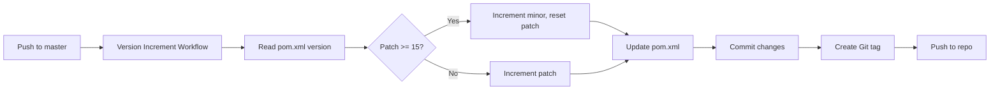

# GitHub Workflows

This directory contains GitHub Actions workflows for automated CI/CD processes.

## Available Workflows

### 1. Auto Version Increment (`version-increment.yml`)
Automatically increments the project version with each commit to the main/master branch.

**Versioning Logic:**
- Increments patch version by 0.0.1 for each commit
- When patch reaches 15, increments minor version and resets patch to 0
- Example: `0.0.15` → `0.1.0`

**Triggers:**
- Push to `master` or `main` branch
- Excludes: `.github/**`, `README.md`, `docs/**`

**Actions:**
- Updates version in `pom.xml`
- Creates commit with `[skip ci]` tag
- Creates Git tag for each version

### 2. CI Build (`ci.yml`)
Runs build and tests on every push and pull request.

**Actions:**
- Sets up JDK 21
- Builds project with Maven
- Runs tests
- Displays current version

## Scripts

### `scripts/increment-version.sh`
Bash script that handles the version increment logic:
- Reads current version from `pom.xml`
- Applies increment rules
- Updates `pom.xml` with new version

## Setup Requirements

### GitHub Repository Settings

1. **Enable GitHub Actions**
   - Go to repository Settings → Actions → General
   - Enable "Read and write permissions" for workflows

2. **Branch Protection (Optional but Recommended)**
   - Protect `master`/`main` branch
   - Allow GitHub Actions bot to push

### Local Testing

To test the version increment script locally:

```bash
# Make script executable
chmod +x .github/scripts/increment-version.sh

# Install xmlstarlet (if not already installed)
# On macOS:
brew install xmlstarlet

# On Ubuntu/Debian:
sudo apt-get install xmlstarlet

# Run the script
./.github/scripts/increment-version.sh
```

## Workflow Sequence



## Troubleshooting

### Workflow not triggering
- Check if commit message contains `[skip ci]`
- Verify branch name matches `master` or `main`
- Check if changes are in excluded paths

### Permission errors
- Ensure "Read and write permissions" are enabled for GitHub Actions
- Check branch protection rules

### xmlstarlet errors
- Ensure the POM file has valid XML structure
- Verify namespace declarations in `pom.xml`

## Version History

All versions are tagged in Git. To view version history:

```bash
git tag -l
```

To checkout a specific version:

```bash
git checkout v0.1.5
```
